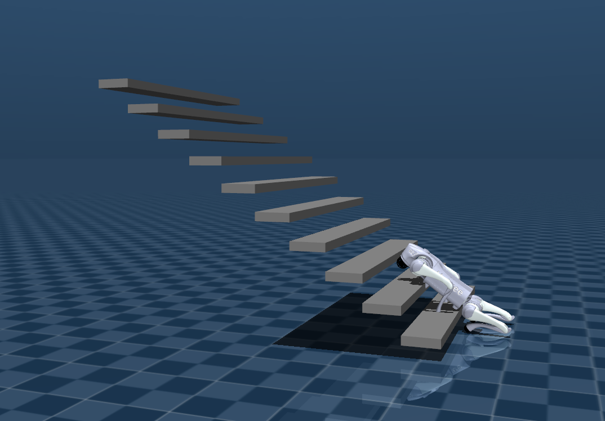
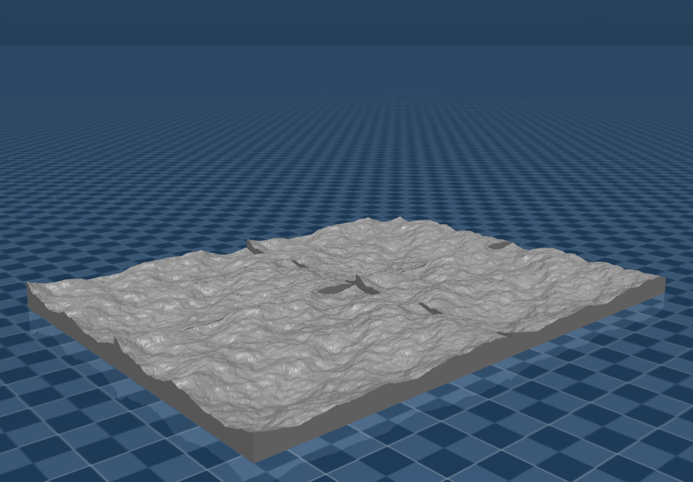
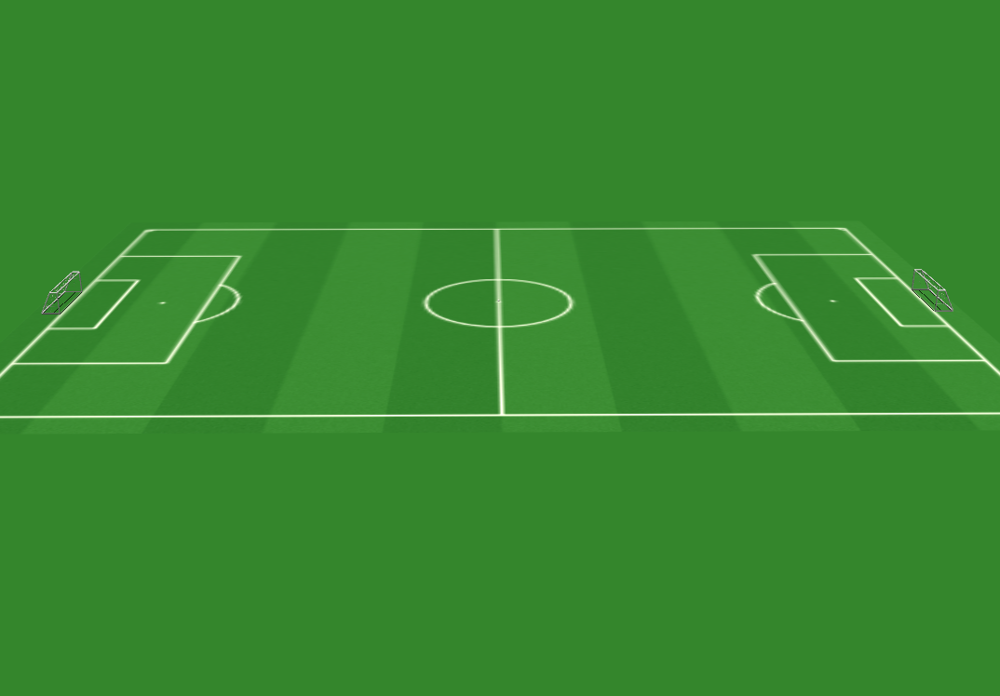
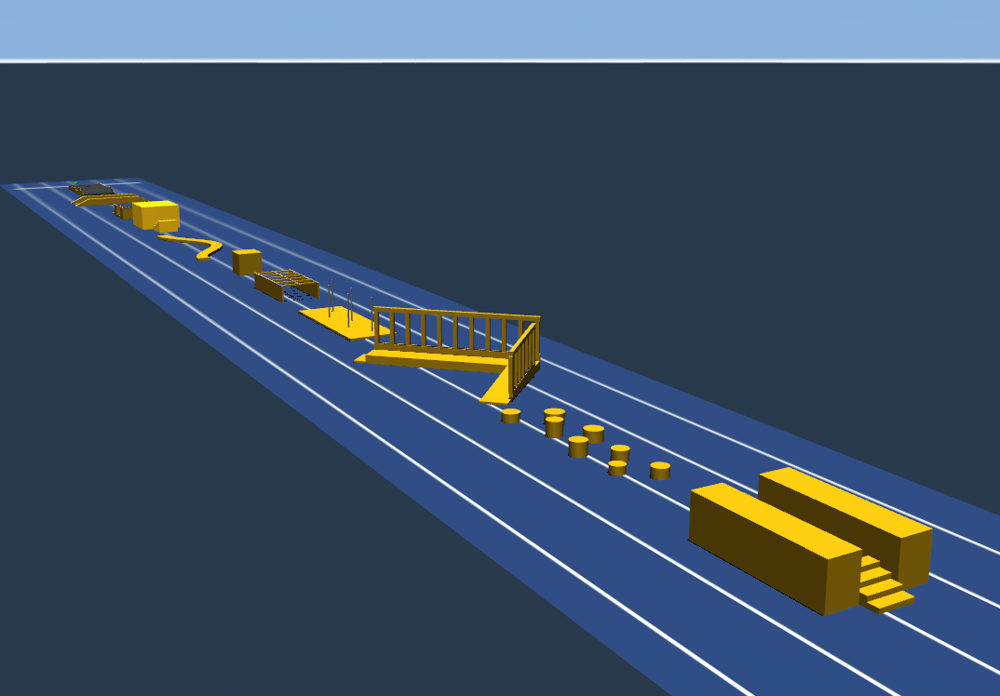
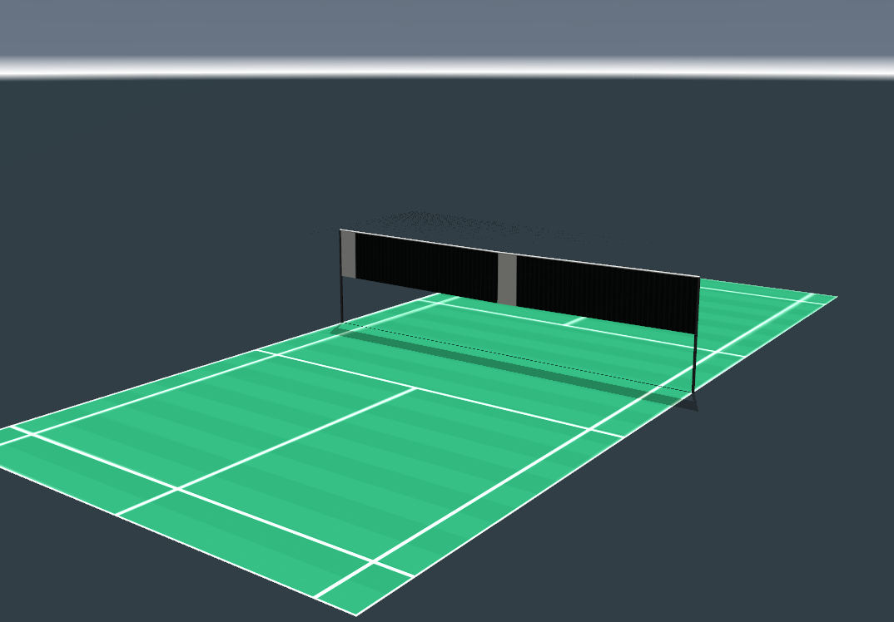
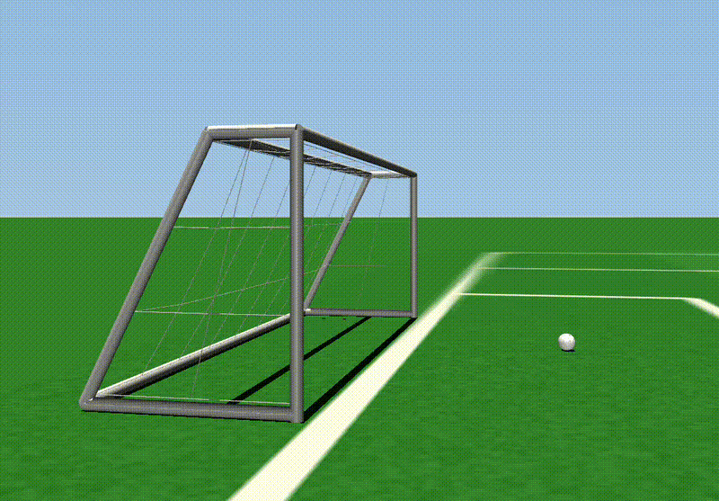
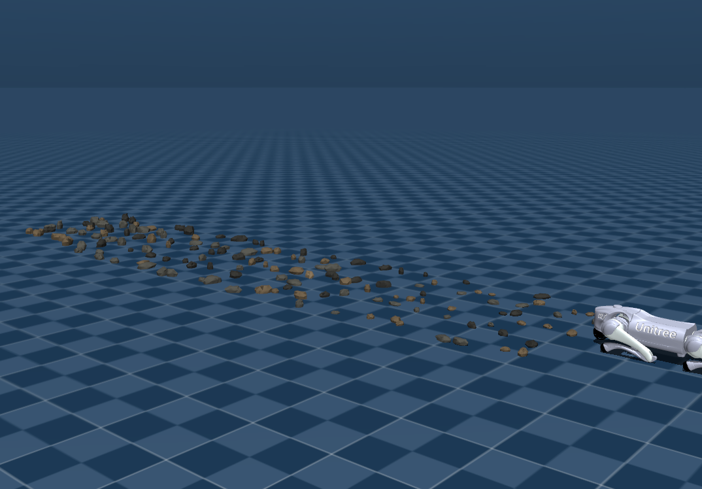

# simEverything

`simEverything` is a collection of MuJoCo MJCF models, meshes, and reusable scene assets for simulating Unitree robots. The repository is intended to be a model asset library: you can open the scene XML files directly in MuJoCo, include the robot XML files in your own environments, or use the assets as a starting point for control, reinforcement learning, and robotics experiments.

## Contents

```text
.
├── environments/          # Reusable environment pieces and playgrounds
├── unitree_robots/        # Unitree robot MJCF models and mesh assets
├── LICENSE
└── README.md
```

### Robot Models

The `unitree_robots` directory contains MJCF models for several Unitree platforms:

| Robot | Main model | Scene file |
| --- | --- | --- |
| A2 | `unitree_robots/a2/a2.xml` | `unitree_robots/a2/scene_a2.xml` |
| B2 | `unitree_robots/b2/b2.xml` | `unitree_robots/b2/scene_b2.xml` |
| B2W | `unitree_robots/b2w/b2w.xml` | `unitree_robots/b2w/scene.xml` |
| G1 | `unitree_robots/g1/g1_23dof.xml`, `unitree_robots/g1/g1_29dof.xml` | `unitree_robots/g1/scene_g1.xml` |
| Go2 | `unitree_robots/go2/go2.xml` | `unitree_robots/go2/scene_go2.xml` |
| Go2W | `unitree_robots/go2w/go2w.xml` | `unitree_robots/go2w/scene_go2w.xml` |
| H1 | `unitree_robots/h1/h1.xml` | `unitree_robots/h1/scene_h1.xml` |
| H1-2 | `unitree_robots/h1_2/h1_2_handless.xml` | `unitree_robots/h1_2/scene_h1_2.xml` |
| R1 | `unitree_robots/r1/r1.xml` | `unitree_robots/r1/scene_r1.xml` |

The main model files define the robot body tree, meshes, joints, actuators, and sensors. The scene files include the robot model plus `environments/common_scene.xml`, then add basic world settings such as floor, lighting, camera statistics, and simulation timestep.

### Common Scenes

`environments` provides reusable environment definitions that can be included from robot scene files:

- Basic shared scene settings in `environments/common_scene.xml`
- Fixed obstacles such as slopes, stairs, and Unitree path elements
- Rough and rugged floor definitions
- Playground-style environments such as badminton court and WRC obstacle course
- Rock assets and a rocky pathway scene

Most optional environment includes in `environments/common_scene.xml` are commented out. Uncomment the include you need, or include those XML files directly in your own scene.

## Environment Gallery

Add screenshots, GIFs, or video links here to show what each environment looks like in MuJoCo. A simple convention is to keep media files under `docs/media/` and reference them from this section.

### Basic Flat Ground


- Scene: `environments/common_scene.xml`
- Description: Default floor, lighting, and camera setup for quick robot loading and controller tests.
- Video: [Add video link here](https://example.com)

### Slopes and Stairs



- Scene examples:
  - `environments/fixed_object/slope_normal/slope_normal.xml`
  - `environments/fixed_object/stairs_normal/stairs_normal.xml`
  - `environments/fixed_object/stairs_suspend/stairs_suspend.xml`
- Description: Fixed terrain objects for testing locomotion stability, foot placement, and obstacle traversal.

### Rough and Rugged Floors



- Scene examples:
  - `environments/floor/rough/rough_floor.xml`
  - `environments/floor/rugged/rugged_floor.xml`
- Description: Uneven terrain assets for evaluating robustness on non-flat ground.

### Playground and Obstacle Courses



- Scene examples:
  - `environments/playground/soccer_court/normal_court/normal_court.xml`
  - `environments/playground/badminton_court/badminton_court.xml`
  - `environments/playground/wrc_obstacle_course/wrc_obstacle_course.xml`
- Description: Larger structured environments for navigation, locomotion, and task-oriented experiments.
- Video: 
<p align="center">
  
</p>

### Rocky Pathway



- Scene: `environments/rock/rocky_pathway.xml`
- Description: Rock-based terrain for testing balance, terrain adaptation, and contact behavior.

## Requirements

- MuJoCo 3.x or newer
- Python 3.8+ if you want to load or simulate the models from Python
- The Python `mujoco` package for script-based usage

Install the Python package with:

```bash
pip install mujoco
```

## Quick Start

Open any scene XML in MuJoCo's viewer or simulator. For example:

```bash
cd ~/unitree_robots/go2
simulate scene_go2.xml
```

If you are using the Python MuJoCo package, you can load a scene like this:

```python
import mujoco

model = mujoco.MjModel.from_xml_path("unitree_robots/go2/scene_go2.xml")
data = mujoco.MjData(model)

for _ in range(1000):
    mujoco.mj_step(model, data)
```

Use the scene files when you want a complete world. Use the main robot files when you want to embed a robot into a custom world of your own.

## Working With Scenes

Each scene file follows this pattern:

```xml
<mujoco model="robot scene">
  <include file="robot.xml"/>
  <include file="../../environments/common_scene.xml"/>
  ...
</mujoco>
```

To change the active robot, open the corresponding scene file. To change the environment, edit the includes in `environments/common_scene.xml` or create a new scene XML that includes a robot and the environment assets you need.

For example, `unitree_robots/g1/scene_g1.xml` uses the 23-DOF G1 model by default and leaves the 29-DOF model commented out. You can switch variants by changing the include:

```xml
<include file="g1_29dof.xml"/>
```

## Repository Notes

- Mesh paths are relative to each robot's `meshdir` setting, so keep each XML file with its matching `assets` or `meshes` directory.
- Most scene files use a timestep of `0.0002`.
- Robot XML files include actuator and sensor definitions suitable for simulation and controller integration.
- The repository stores model assets only; it does not provide a controller, policy, or training pipeline.

## License

This project is released under the MIT License. See [LICENSE](LICENSE) for details.
